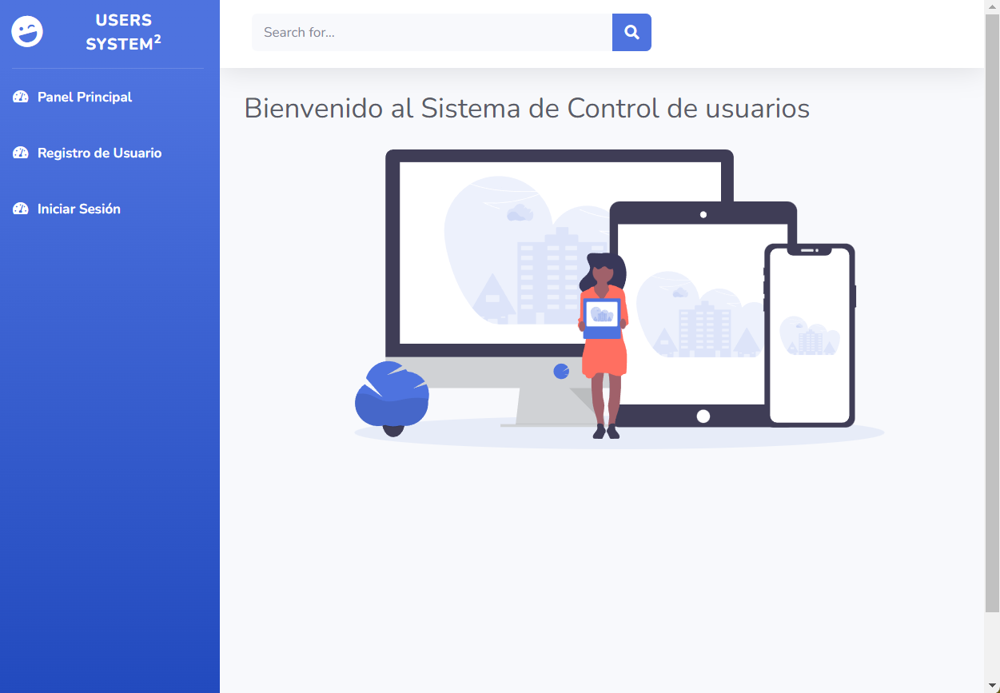

# Registro, Login y Gestión de Usuarios con Spring Boot, Spring Security, JWT, MySQL, Maven y Hibernate


_Aplicación web para la gestión de usuarios_

## Comenzando 🚀

_Este proyecto combiana varias tecnologías para la creación de una aplicación web que permite la gestión de usuarios y roles. El proyecto se encuentra en desarrollo y se irán agregando nuevas funcionalidades
Este realizado en un entorno local_

Mira **Despliegue** para conocer como desplegar el proyecto.


### Pre-requisitos 📋

_XAMP con servidor Apache y Mysql para la base de datos de usuarios_

_Clonar el repositorio, compilar el proyecto con Maven y arrancar el servidor Tomcat Embebido desde IntelliJ_


## Despliegue 📦

_Punto de entrada de la aplicación_

```
(http://localhost:81/index.html)
```



## Construido con 🛠️

_Menciona las herramientas que utilizaste para crear tu proyecto_

* [Sprinboot](https://spring.io/projects/spring-boot) - El framework web usado
* [Maven](https://maven.apache.org/) - Manejador de dependencias
* [Hibernate](https://hibernate.org/) - Usado para mapear objetos a relacional
* [Spring Security](https://spring.io/projects/spring-security) - Usado para la seguridad de la aplicación
* [JWT](https://jwt.io/) - Usado para la autenticación de usuarios
* [MySQL](https://www.mysql.com/) - Usado para la base de datos


## Colaboradores ✒️

_Menciona a todos aquellos que ayudaron a levantar el proyecto desde sus inicios_

* **Lucas Moy**  - [lucasmoy-dev](https://github.com/lucasmoy-dev)
* [Curso de Java](https://www.youtube.com/watch?v=7vHzVN0EiQc&t=9597s&ab_channel=ATLAcademy%28byLucasMoy%29)

---
⌨️ con ❤️ por [andresito87](https://github.com/andresito87) 😊
